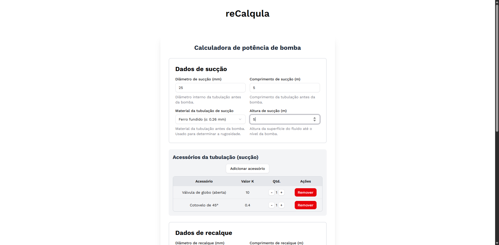

# reCalqula
reCalqula é uma calculadora online usada para determinar a potência necessária para uma bomba em um sistema de recalque.
## Testando a calculadora
```
git clone https://github.com/hossokawa/recalqula.git
cd recalqula
yarn dev
```
## Screenshots



